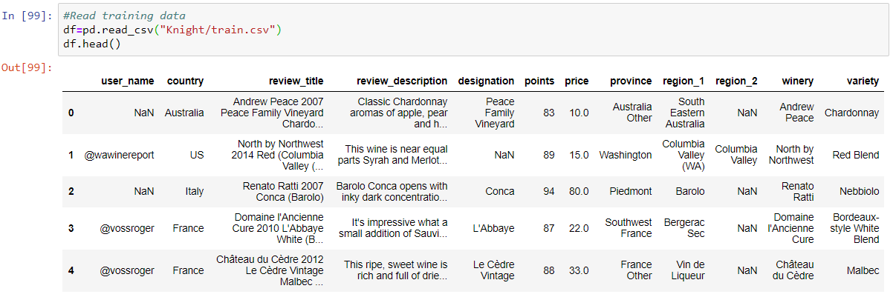
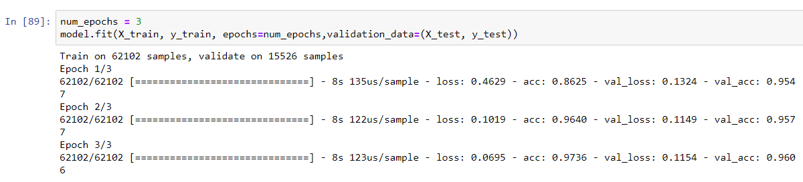

# Wine-Classifier

## Problem statement - 
## A dataset of over 100000 wine reviews from kaggle has been given.
   Ref : https://www.kaggle.com/zynicide/wine-reviews
### The Data Description is as follows:
•	user_name - user_name of the reviewer  
•	country -The country that the wine is from.  
•	review_title - The title of the wine review, which often contains the vintage.  
•	review_description - A verbose review of the wine.   
•	designation - The vineyard within the winery where the grapes that made the wine are from.  
•	points - ratings given by the user. The ratings are between 0 -100.  
•	price - The cost for a bottle of the wine  
•	province - The province or state that the wine is from.  
•	region_1 - The wine-growing area in a province or state (ie Napa).  
•	region_2 - Sometimes there are more specific regions specified within a wine-growing area (ie Rutherford inside the Napa Valley), but this value can sometimes be blank.  
•	winery - The winery that made the wine  
•	variety - The type of grapes used to make the wine. 

### The aim is to predict the wine variety based on given review

## Approach

The dependent variable is the wine variety. There are a total of 28 varieties of wine in the dataset. This is classification problem. 
There are 11 independent variables. 2 of these are numeric : price and points. 7 are categorical - country, username, province, region1, region2, designation and winery. The other two, review_title and review_description are textual data.  
 
We will take 2 different approaches : one for the numerical and categorical data, and a second approach for the textual data. The textual data will require natural language processing.

### Some common pre-processing 
We look for duplicate reviews, null values and, the target variable.

There are initially 82628 reviews

We eliminate duplicate reviews to bring it down to 77628.

There are a total of 28 varieties of wine

## For numerical and categorical data.

We discard the user_name of the reviewer as it should have no bearing on the type of wine
Analysis of the data reveals that`

## For text data
We use different natural language processing techniques for this purpose.

I trained the model on the two pieces of textual info :

1) The review title
2) Review description

## For review_title

We find that often, the review title contains the name of the wine. Analysis of the training dataset shows that out of 77628 entries, 48450 contain the name of one or more wine in the review title. We do not consider those entries which have more than one wine in the title. This gives us 47783 entries with a single wine type appearing in the review name. Out of these,in 46886 cases the wine type matches the actual variety of the wine. This means in 98.12% cases when a wine name appears in the review title name, it is the actual variety of the wine. While not applying any ML technique, this a valuable insight nonetheless. As such, a model trained on the corpus of the review title is highly likely to perform well.

### Cleaning and pre-processing

1. Convert to lower case
2. Remove stop words
3. Remove some other high frequency neutral words
4. Stemming(reducing words to the root)

To convert the texts into values readable by the neural network, we perform tokenization. Each text word is replaced by a token. To ease our training and retain important pieces of info only, we set the vocabulary size at 10000. Words outside of this will be denoted by <OOV> or out of vocabulary. We then pad each sentence with zeroes so the input sentences are all of the same length,=.
  

   
Then I built the simple neural network, using word embeddings. I added the word embedding layer before the dense layer, as embeddings enable us to have vectorized representations of words and better represent relationships between words.
I did not use RNNS or LSTMs since a few keywords/ bag of words approach suffices for this problem and the sequence of the data does not matter much.

   

The model trained on solely review titles gives a peak accuracy of 95.6%. 

While this gives a good accuracy, it is hardly a surprise as most of the review titles contain the name of the wine, and the accuracy also depends on how the taster labels the review. To implement a more generalized classifier which will not depend on the naming format of the taster, we look at the review descriptions. These are going to be a descriptor of the qualities of wine only and hence free from biases.

## NLP on review_description
There are a total of  77628 reviews.

The initial cleaning a pre-processing steps remain the same.
After changing case, removing non-alpha numeric symbols and eliminatings stopwords, I plotted word clouds of the data to get some insights into it.

